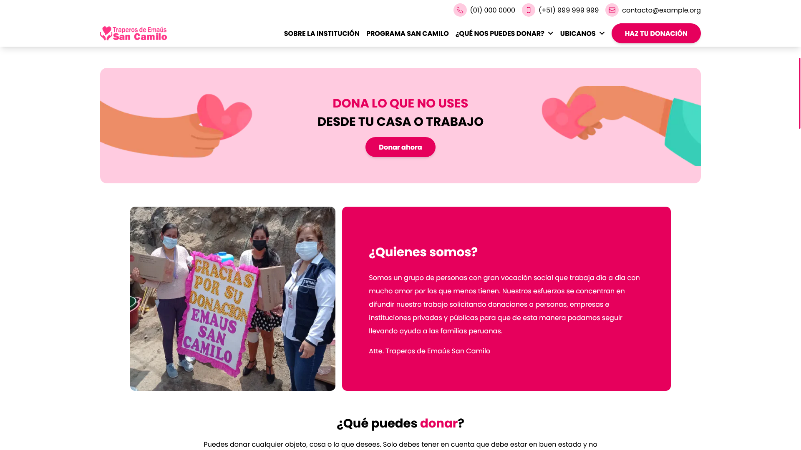

# Emaus San Camilo

## Table of contents

- [Overview](#overview)
  - [Screenshot](#screenshot)
  - [Links](#links)
- [My process](#my-process)
  - [Built with](#built-with)
  - [Continued development](#continued-development)

## Overview

### 🔥 Screenshot 🔥

### Links

- Live Site URL: 👉 [Live Site](https://emaussancamilo.vercel.app)

## My process

### Built with

- Semantic HTML5 markup
- TailwindCSS
- Flexbox
- Mobile-first workflow
- [NextJS](https://nextjs.org/) - JS library
- [Emotion](https://emotion.sh) - For styles
- [Twin Macro](https://github.com/ben-rogerson/twin.macro) - For styles
- [React Icons](https://react-icons.github.io/react-icons/) - For Icons
- [SwiperJS](https://swiperjs.com/) - For Slider

### Continued development

- Improve performance for images
- Use next/dynamic for performance
